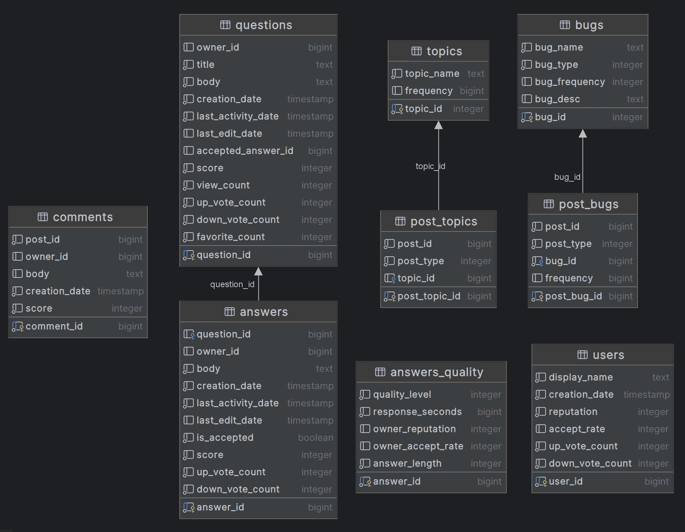

## CS209A-Proj-Backend

### Tech

- Crawler: [OkHttp3](https://square.github.io/okhttp/)
- Analysis: [Stanford CoreNLP](https://stanfordnlp.github.io/CoreNLP/)
- Database: [MyBatis-Plus](https://baomidou.com/)

### Entity Relationship Diagram

### How to Create Database

We use [PostgreSQL](https://www.postgresql.org/) 17.2 as our database system.

Check .[/sql](./sql) for necessary preset SQLs, including create user, database and schema.

### How to Start Crawler

Check [app from crawler module](./crawler/src/main/kotlin/io/github/octcarp/sustech/cs209a/proj/crawler/app), run the `FetcherMain` , get data.

Move data JSON files to [crawler resources](./crawler/src/main/resources/data/final)

Start `ImporterMain` 

### How to Start API

Check [Java API module](./api-java), run Spring Boot Application.