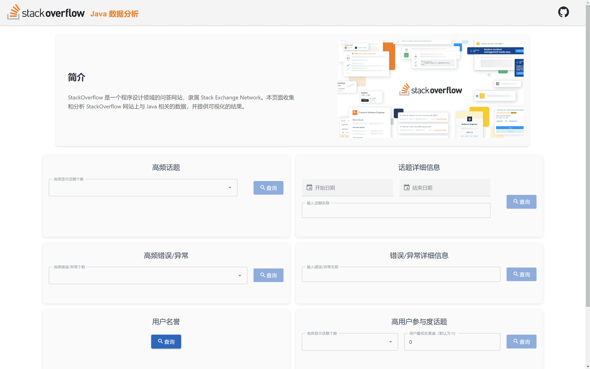
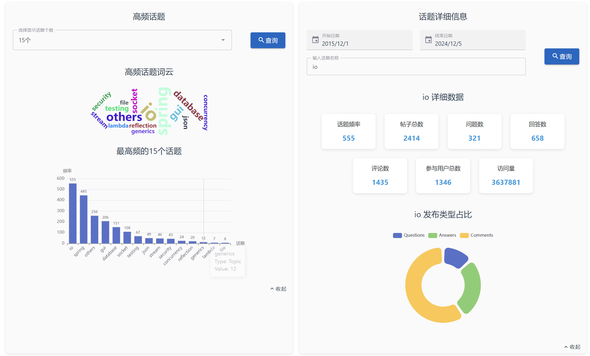
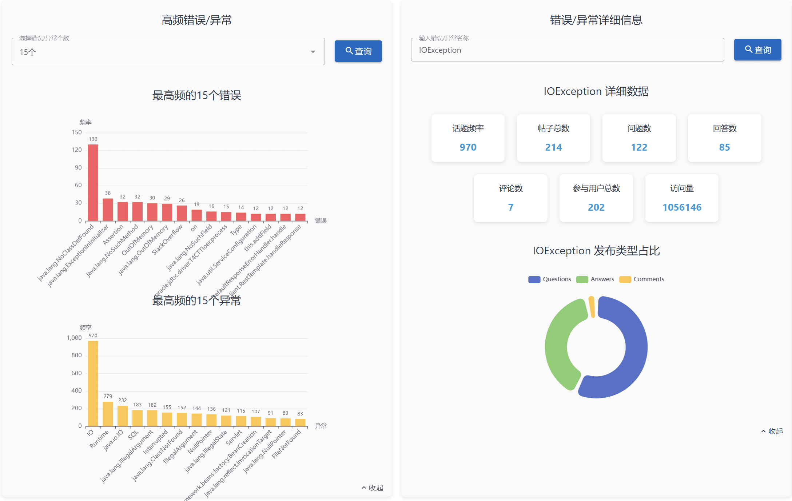
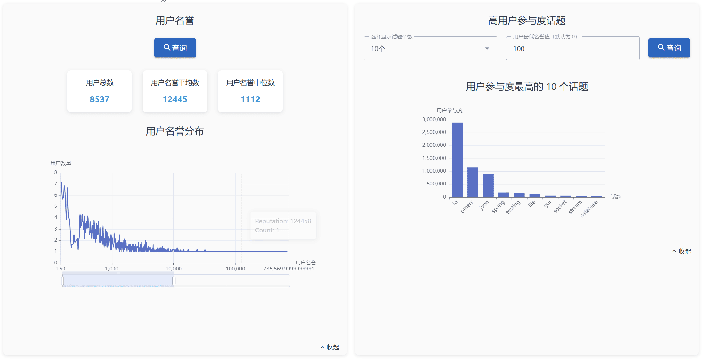
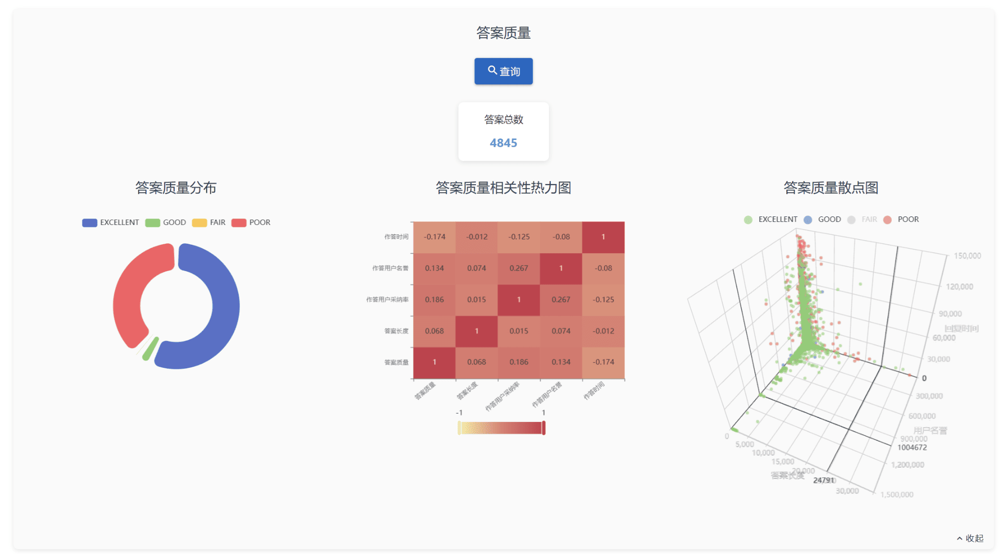

# SUSTech_CS209A-Java2_F24_Proj
 (Spring Boot + Vue3) Stack Overflow data crawling and visualization: Our project of CS209A 2024 Fall: Computer System Design and Applications A (a.k.a. Java 2), SUSTech. Taught by Yida Tao [@yidatao](https://github.com/yidatao).

Full score. Lab Teacher's evaluation: Good visualization. Could be recommended for lecture presentation if completed one week earlier.

### About

This is a course project, and the main goal is to complete data crawling and visualization. Check [docs/requirement](docs/requirement) for requirements.

However, the algorithm for data analysis may be relatively simple or even wrong. Please refer to it as appropriate for data analysis part.

Check `Readme.md` files in back-end or front-end for more information.

### Contributor

[@Octcarp](https://github.com/OctCarp) : Data crawling and analysis, RESTful Back-end API.

[@YuJian-63](https://github.com/YuJian-63) : Front-end, data visualization design.

### Page Presentation

#### Main Page

#### Component Details

  
  
  
  

